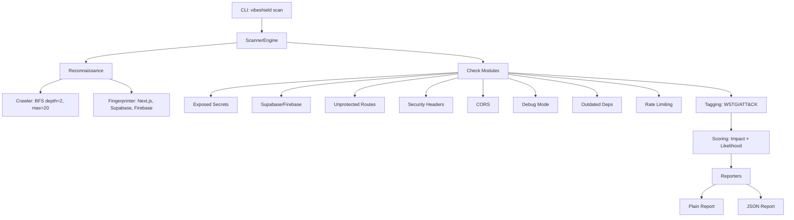

# VibeShield

> Security scanner for AI-assisted/vibe-coded web apps

[](https://pypi.org/project/vibeshield/)
[](https://pypi.org/project/vibeshield/)
[](LICENSE)

VibeShield is a security scanner designed specifically for the vulnerabilities that repeatedly appear in AI-assisted ("vibe-coded") projects — apps built fast on Next.js, Supabase, Firebase, or similar stacks, often without a security background involved at any point.

## What it does

Point it at a deployed URL you own → it investigates → it tells you, in order of real urgency, what's wrong and how to fix it.

### Checks included (v1)

| Check | What it finds | Severity |
|-------|--------------|----------|
| **Exposed Secrets** | API keys, tokens, credentials in client-side JS bundles or exposed `.env` files | Critical |
| **Supabase/Firebase Misconfig** | Anon key present but RLS not enforced — anyone can read/write data | Critical/High |
| **Unprotected API Routes** | Routes that should require auth but don't | High |
| **Missing Security Headers** | No CSP, HSTS, X-Frame-Options, etc. | Medium/Low |
| **Permissive CORS** | `Access-Control-Allow-Origin: *` on sensitive endpoints | Medium/Critical |
| **Debug Mode Left On** | Verbose errors, exposed debug endpoints, source maps | Medium/Low |
| **Outdated Dependencies** | Client-side libraries with known CVEs (CVSS ≥ 7.0) | High |
| **No Rate Limiting on Auth** | Login/signup forms vulnerable to brute force | High |

## Installation

```bash
# Recommended: isolated install with pipx
pipx install vibeshield

# Or with pip (in a virtual environment)
pip install vibeshield
```

## Usage

```bash
# Basic scan (requires ownership confirmation)
vibeshield scan https://your-app.com --confirm-ownership

# JSON output for programmatic use
vibeshield scan https://your-app.com --confirm-ownership --output json

# Both plain and JSON
vibeshield scan https://your-app.com --confirm-ownership --output both

# Save to file
vibeshield scan https://your-app.com --confirm-ownership -f report.json

# Adjust crawl limits
vibeshield scan https://your-app.com --confirm-ownership --max-pages 50 --max-depth 3
```

### Ethical Use / Consent Guard

**You must confirm ownership** with `--confirm-ownership` (or `-y`) before any scan runs. This is both an ethical/legal safeguard and a credibility signal.

> Only scan applications you own or have explicit written permission to test. Unauthorized scanning is unethical and may violate laws including the CFAA (US) and Computer Misuse Act (UK).

## Output

### Plain-language report (default)

```
============================================================
VibeShield Security Scan Report
============================================================
Target: https://your-app.com
Scanned: 2024-01-15T10:30:00Z
Duration: 8420ms
Pages crawled: 12

Framework: nextjs
  Version: 14.2.0
BaaS detected: supabase

------------------------------------------------------------
SUMMARY: 2 Critical, 1 High, 3 Medium, 2 Low, 1 Info
------------------------------------------------------------

### Critical (2) ###

1. Supabase RLS Bypass on 'users' Table
   What's wrong: POST succeeded - RLS may not be blocking inserts on 'users'
   Why it matters: https://supabase.com/docs/guides/auth/row-level-security
   How to fix: Enable Row Level Security on 'users' table in Supabase Dashboard. Create policies: `CREATE POLICY ... USING (auth.role() = 'authenticated');`

2. Exposed AWS Access Key
   What's wrong: Exposed AWS Access Key in client bundle
   Why it matters: https://owasp.org/www-project-top-ten/2021/A07_2021-Identification_and_Authentication_Failures
   How to fix: Rotate key immediately in AWS IAM. Move to server-side environment variable.
```

### JSON report (for Phase 2 / automation)

```json
{
  "scan_metadata": { "target": "...", "timestamp": "...", "duration_ms": 8420, ... },
  "fingerprint": { "framework": "nextjs", "baas": ["supabase"], ... },
  "findings": [
    {
      "id": "finding-a1b2c3d4",
      "check": "supabase_firebase",
      "title": "Supabase RLS Bypass on 'users' Table",
      "severity": "Critical",
      "score": 20,
      "impact": 5,
      "likelihood": 4,
      "wstg_id": "WSTG-ATHZ-02",
      "attck_ids": ["T1213"],
      "evidence": { "url": "...", "snippet": "...", "matched_pattern": "..." },
      "confidence": 0.85,
      "remediation": "Enable Row Level Security...",
      "references": [...]
    }
  ],
  "summary": { "critical": 2, "high": 1, "medium": 3, "low": 2, "info": 1 }
}
```

## How it works

1. **Target intake** — URL + explicit ownership confirmation
2. **Reconnaissance** — Shallow crawl (depth 2, max 20 pages) + stack fingerprinting (Next.js, Supabase, Firebase, etc.)
3. **Checks** — Each check is an independent module that runs targeted requests based on fingerprint
4. **Tagging** — Every finding gets OWASP WSTG and MITRE ATT&CK tags (visible in JSON, hidden from plain report)
5. **Scoring** — Transparent `Impact × Likelihood` calculation → Critical/High/Medium/Low/Info
6. **Reporting** — Two layers from one run: plain-language (default) + full JSON

## Methodology

Every finding is internally tagged against:
- **OWASP Web Security Testing Guide (WSTG)** — e.g., `WSTG-ATHZ-02`, `WSTG-INFO-02`
- **MITRE ATT&CK** — e.g., `T1552.001`, `T1213`, `T1556.002`

This makes the tool's judgments traceable to established methodology, not vibes of its own.

## Exit codes

| Code | Meaning |
|------|---------|
| 0 | Clean (no findings) |
| 1 | Error / missing `--confirm-ownership` |
| 2 | Critical findings present |
| 3 | High findings present (no Critical) |
| 130 | Interrupted (Ctrl+C) |

## Development

```bash
# Clone and install in dev mode
git clone https://github.com/your-org/vibeshield
cd vibeshield
pip install -e ".[dev]"

# Run tests
pytest

# Lint
ruff check src tests

# Type check
mypy src
```

## Architecture



```
vibeshield/
├── src/vibeshield/
│   ├── cli.py              # Typer CLI with ownership guard
│   ├── scanner/
│   │   ├── engine.py       # ScannerEngine - orchestrates all checks
│   │   ├── crawl.py        # Shallow BFS crawl (depth 2, max 20)
│   │   ├── recon.py        # Stack fingerprinting
│   │   ├── checks/         # 8 independent check modules
│   │   ├── scoring.py      # Impact × Likelihood calculator
│   │   └── tagging.py      # WSTG/ATT&CK tag mappings
│   ├── reporting/
│   │   ├── plain.py        # PlainLanguageReporter
│   │   └── json.py         # JSONReporter
│   └── utils/
│       ├── http.py         # Async HTTP client with retry
│       └── patterns.py     # Regex patterns for secrets, versions
└── tests/                  # Unit tests for each check
```

## Roadmap

- **Phase 1** (this release): Scanner engine with 8 checks, dual reporting, PyPI release ✓
- **Phase 2**: AI-powered report interpretation — plain-language explanations, risk framing, copy-pasteable fixes
- **Phase 3**: CI/CD integration, GitHub Action, SARIF output, scheduled scans

## License

MIT — see [LICENSE](LICENSE)

## Contributing

Issues and PRs welcome. Please read the ethical use policy before contributing scanning capabilities.

---

**Built for solo founders, students, and indie hackers who shipped something with AI help and have no way to know if it's safe.**