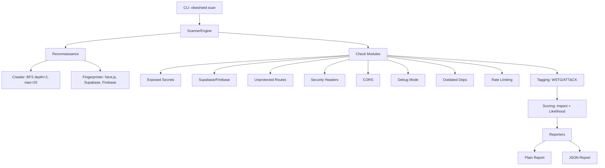

# VibeShield

> Security scanner for AI-assisted/vibe-coded web apps

[](https://pypi.org/project/vibeshield/)
[](https://pypi.org/project/vibeshield/)
[](LICENSE)

VibeShield is a security scanner designed specifically for the vulnerabilities that repeatedly appear in AI-assisted ("vibe-coded") projects — apps built fast on Next.js, Supabase, Firebase, or similar stacks, often without a security background involved at any point.

## What it does

Point it at a deployed URL you own → it investigates → it tells you, in order of real urgency, what's wrong and how to fix it.

### Checks included (v1)

| Check | What it finds | Severity |
|-------|--------------|----------|
| **Exposed Secrets** | API keys, tokens, credentials in client-side JS bundles or exposed `.env` files | Critical |
| **Supabase/Firebase Misconfig** | Anon key present but RLS not enforced — anyone can read/write data | Critical/High |
| **Unprotected API Routes** | Routes that should require auth but don't | High |
| **Missing Security Headers** | No CSP, HSTS, X-Frame-Options, etc. | Medium/Low |
| **Permissive CORS** | `Access-Control-Allow-Origin: *` on sensitive endpoints | Medium/Critical |
| **Debug Mode Left On** | Verbose errors, exposed debug endpoints, source maps | Medium/Low |
| **Outdated Dependencies** | Client-side libraries with known CVEs (CVSS ≥ 7.0) | High |
| **No Rate Limiting on Auth** | Login/signup forms vulnerable to brute force | High |

## Installation

```bash
# Recommended: isolated install with pipx
pipx install vibeshield

# Or with pip (in a virtual environment)
pip install vibeshield
```

## Usage

```bash
# Basic scan (requires ownership confirmation)
vibeshield scan https://your-app.com --confirm-ownership

# JSON output for programmatic use
vibeshield scan https://your-app.com --confirm-ownership --output json

# Both plain and JSON
vibeshield scan https://your-app.com --confirm-ownership --output both

# Save to file
vibeshield scan https://your-app.com --confirm-ownership -f report.json

# Adjust crawl limits
vibeshield scan https://your-app.com --confirm-ownership --max-pages 50 --max-depth 3
```

### Ethical Use / Consent Guard

**You must confirm ownership** with `--confirm-ownership` (or `-y`) before any scan runs. This is both an ethical/legal safeguard and a credibility signal.

> Only scan applications you own or have explicit written permission to test. Unauthorized scanning is unethical and may violate laws including the CFAA (US) and Computer Misuse Act (UK).

## Output

### Plain-language report (default)

```
============================================================
VibeShield Security Scan Report
============================================================
Target: http://localhost:8080
Scanned: 2026-08-24T18:55:40Z
Duration: 9611ms
Pages crawled: 1

Framework: (not detected)
BaaS detected: (none)

------------------------------------------------------------
SUMMARY: 1 Critical, 2 High, 4 Medium, 1 Low, 3 Info
------------------------------------------------------------

### Critical (1) ###

1. Exposed AWS Access Key
   What's wrong: Exposed AWS Access Key in client bundle
   Why it matters: https://owasp.org/www-project-top-ten/2021/A07_2021-Identification_and_Authentication_Failures
   How to fix: Rotate key immediately in AWS IAM. Move to server-side environment variable.

### High (2) ###

2. Unprotected API Endpoint: /api/users
   What's wrong: Returned user data without authentication
   Why it matters: https://owasp.org/www-project-web-security-testing-guide/latest/4-Web_Application_Security_Testing/05-Authorization_Testing/02-Testing_Authorization_Bypass
   How to fix: Add authentication middleware to this route. In Next.js: export const middleware = authMiddleware; In Express: app.use('/api/', requireAuth); In Supabase: ensure RLS policies require auth.

3. No Rate Limiting on Auth Endpoint: /api/auth/login
   What's wrong: 5/5 requests succeeded without rate limiting
   Why it matters: https://owasp.org/www-project-web-security-testing-guide/latest/4-Web_Application_Security_Testing/04-Authentication_Testing/03-Testing_for_Password_Guessing
   How to fix: Implement rate limiting on auth endpoints. Next.js: Use @upstash/ratelimit or custom middleware. Express: Use express-rate-limit. Nginx: limit_req_zone. Supabase: Enable rate limiting in dashboard. Recommended: 5 requests/minute for login, 10/hour for signup.

### Medium (4) ###

4. Exposed Generic API Key
   What's wrong: API key pattern detected in client-side code
   Why it matters: https://owasp.org/www-project-top-ten/2021/A07_2021-Identification_and_Authentication_Failures
   How to fix: Move key to server-side environment variable. Rotate if exposed.

5. Missing Security Header: Content-Security-Policy
   What's wrong: No CSP header present
   Why it matters: https://developer.mozilla.org/en-US/docs/Web/HTTP/CSP
   How to fix: Add CSP header. Start with: Content-Security-Policy: default-src 'self'; script-src 'self'; style-src 'self' 'unsafe-inline'; img-src 'self' data:; font-src 'self'; connect-src 'self'; frame-ancestors 'none';

6. Missing Security Header: Strict-Transport-Security
   What's wrong: No HSTS header present
   Why it matters: https://developer.mozilla.org/en-US/docs/Web/HTTP/Headers/Strict-Transport-Security
   How to fix: Add HSTS header: Strict-Transport-Security: max-age=31536000; includeSubDomains; preload

7. Missing Security Header: X-Frame-Options
   What's wrong: No X-Frame-Options header present
   Why it matters: https://developer.mozilla.org/en-US/docs/Web/HTTP/Headers/X-Frame-Options
   How to fix: Add X-Frame-Options: DENY (or SAMEORIGIN if you need framing)

### Low (1) ###

8. Missing Security Header: X-Content-Type-Options
   What's wrong: No X-Content-Type-Options header present
   Why it matters: https://owasp.org/www-project-web-security-testing-guide/latest/4-Web_Application_Security_Testing/11-Client-side_Testing/01-Testing_for_Client_Side_Cross_Site_Scripting
   How to fix: Add X-Content-Type-Options: nosniff

### Info (3) ###

9. Missing Security Header: Referrer-Policy
   What's wrong: No Referrer-Policy header present
   Why it matters: https://owasp.org/www-project-web-security-testing-guide/latest/4-Web_Application_Security_Testing/11-Client-side_Testing/01-Testing_for_Client_Side_Cross_Site_Scripting
   How to fix: Add Referrer-Policy: strict-origin-when-cross-origin

10. Missing Security Header: Permissions-Policy
    What's wrong: No Permissions-Policy header present
    Why it matters: https://owasp.org/www-project-web-security-testing-guide/latest/4-Web_Application_Security_Testing/11-Client-side_Testing/01-Testing_for_Client_Side_Cross_Site_Scripting
    How to fix: Add Permissions-Policy: geolocation=(), microphone=(), camera=()

11. Server Version Disclosure
    What's wrong: Server header reveals "SimpleHTTP/0.6 Python/3.14.0"
    Why it matters: https://owasp.org/www-project-web-security-testing-guide/latest/4-Web_Application_Security_Testing/01-Information_Gathering/02-Fingerprint_Web_Server
    How to fix: Remove or obfuscate Server and X-Powered-By headers. In Nginx: server_tokens off; In Express: app.disable('x-powered-by')
```

### JSON report (for Phase 2 / automation)

```json
{
  "scan_metadata": {
    "target": "http://localhost:8080",
    "timestamp": "2026-08-24T18:55:40.135184Z",
    "version": "1.0.0",
    "duration_ms": 9611,
    "crawl_depth": 1,
    "max_pages": 1,
    "pages_crawled": 1,
    "checks_run": [
      "ExposedSecretsCheck",
      "SupabaseFirebaseCheck",
      "UnprotectedRoutesCheck",
      "SecurityHeadersCheck",
      "CORSCheck",
      "DebugModeCheck",
      "OutdatedDepsCheck",
      "RateLimitingCheck"
    ]
  },
  "fingerprint": {
    "framework": null,
    "framework_version": null,
    "baas": [],
    "technologies": [],
    "headers": {
      "server": "SimpleHTTP/0.6 Python/3.14.0",
      "date": "Mon, 24 Aug 2026 18:55:32 GMT",
      "content-type": "text/html"
    },
    "js_bundles": [],
    "api_endpoints": [
      "http://localhost:8080/api/auth/login",
      "http://localhost:8080/api/users"
    ]
  },
  "findings": [
    {
      "id": "finding-28decd7d",
      "check": "exposed_secrets",
      "title": "Exposed AWS Access Key",
      "severity": "Critical",
      "score": 20,
      "impact": 5,
      "likelihood": 4,
      "wstg_id": "WSTG-INFO-02",
      "attck_ids": ["T1552.001"],
      "evidence": {
        "url": "http://localhost:8080",
        "snippet": "...const apiKey = \"AKIA1234567890ABCDEF\"...",
        "matched_pattern": "AKIA1234567890ABCDEF",
        "request_headers": {},
        "response_headers": {},
        "response_status": null
      },
      "confidence": 0.9,
      "remediation": "Rotate key immediately in AWS IAM. Move to server-side environment variable.",
      "references": [
        "https://owasp.org/www-project-top-ten/2021/A07_2021-Identification_and_Authentication_Failures",
        "https://cheatsheetseries.owasp.org/cheatsheets/Secrets_Management_Cheat_Sheet.html"
      ]
    }
  ],
  "summary": { "critical": 1, "high": 2, "medium": 4, "low": 1, "info": 3 }
}
```

## How it works

1. **Target intake** — URL + explicit ownership confirmation
2. **Reconnaissance** — Shallow crawl (depth 2, max 20 pages) + stack fingerprinting (Next.js, Supabase, Firebase, etc.)
3. **Checks** — Each check is an independent module that runs targeted requests based on fingerprint
4. **Tagging** — Every finding gets OWASP WSTG and MITRE ATT&CK tags (visible in JSON, hidden from plain report)
5. **Scoring** — Transparent `Impact × Likelihood` calculation → Critical/High/Medium/Low/Info
6. **Reporting** — Two layers from one run: plain-language (default) + full JSON

## Methodology

Every finding is internally tagged against:
- **OWASP Web Security Testing Guide (WSTG)** — e.g., `WSTG-ATHZ-02`, `WSTG-INFO-02`
- **MITRE ATT&CK** — e.g., `T1552.001`, `T1213`, `T1556.002`

This makes the tool's judgments traceable to established methodology, not vibes of its own.

## Exit codes

| Code | Meaning |
|------|---------|
| 0 | Clean (no findings) |
| 1 | Error / missing `--confirm-ownership` |
| 2 | Critical findings present |
| 3 | High findings present (no Critical) |
| 130 | Interrupted (Ctrl+C) |

## Development

```bash
# Clone and install in dev mode
git clone https://github.com/your-org/vibeshield
cd vibeshield
pip install -e ".[dev]"

# Run tests
pytest

# Lint
ruff check src tests

# Type check
mypy src
```

> **Note for eval harness:** The triage evaluation golden set (`src/vibeshield/triage/eval/golden.json`) contains `real_scan` entries bootstrapped from a specific frozen report at `tests/fixtures/golden_report.json`. Re-running `vibeshield scan` generates new random `finding.id` values — to evaluate against the golden set, generate triage results from that exact frozen report, not a fresh scan. See `scripts/bootstrap_golden.py` for details.

## Architecture



```
vibeshield/
├── src/vibeshield/
│   ├── cli.py              # Typer CLI with ownership guard
│   ├── scanner/
│   │   ├── engine.py       # ScannerEngine - orchestrates all checks
│   │   ├── crawl.py        # Shallow BFS crawl (depth 2, max 20)
│   │   ├── recon.py        # Stack fingerprinting
│   │   ├── checks/         # 8 independent check modules
│   │   ├── scoring.py      # Impact × Likelihood calculator
│   │   └── tagging.py      # WSTG/ATT&CK tag mappings
│   ├── reporting/
│   │   ├── plain.py        # PlainLanguageReporter
│   │   └── json.py         # JSONReporter
│   └── utils/
│       ├── http.py         # Async HTTP client with retry
│       └── patterns.py     # Regex patterns for secrets, versions
└── tests/                  # Unit tests for each check
```

## Roadmap

- **Phase 1** (this release): Scanner engine with 8 checks, dual reporting, PyPI release ✓
- **Phase 2**: AI-powered report interpretation — plain-language explanations, risk framing, copy-pasteable fixes
- **Phase 3**: CI/CD integration, GitHub Action, SARIF output, scheduled scans

## License

MIT — see [LICENSE](LICENSE)

## Contributing

Issues and PRs welcome. Please read the ethical use policy before contributing scanning capabilities.

---

**Built for solo founders, students, and indie hackers who shipped something with AI help and have no way to know if it's safe.**